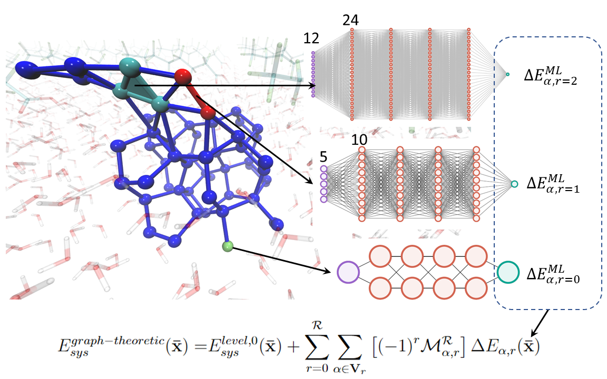

# Neural Network Molecular Force Field — Package README

A machine learning pipeline for training and deploying neural network models of molecular potential energy surfaces and atomic forces, with transfer learning support for adapting models from small reference systems to larger target systems.



We aim to integrate graph representation (graph theoretic fragmentation) of molecules with machine learning to significantly reduce the computational cost for training samples and neural network model complexity together with training epochs. With graph representation, exploration of new regions of data space, or more specifically, potential energy configuration space is carried out by constructing a series of localized, lower-dimensional fragment (subsystem) spaces. 

## Package Structure

```
fragment_modeling/
├── fragment_transform.py   ← geometry canonicalization (atom_ordering module)
├── prepare_transfer.py     ← training data preprocessing
├── model_init.py           ← neural network construction and normalization
├── model_load_predict.py   ← model loading and inference
└── transfer.py             ← transfer learning and active learning loop
```

### Pipeline Overview

```
Raw molecular geometry + forces
        ↓
fragment_transform.py     — canonical inertia-axis alignment, permutation sorting
        ↓
prepare_transfer.py       — pairwise distance features, force projection
        ↓
model_init.py             — build network, define normalization parameters
        ↓
transfer.py               — incremental retraining via distance-sliced clustering
        ↓
model_load_predict.py     — load saved models, predict energy and forces
```

---

## Dependencies

- Python 3.8+
- NumPy
- SciPy
- TensorFlow / Keras
- scikit-learn

Install:
```bash
pip install numpy scipy tensorflow scikit-learn
```

---

## Module Reference

### `fragment_transform.py`

Canonicalizes molecular fragment geometries and forces by aligning them to a consistent principal inertia axis frame. Removes rotational and permutational ambiguity before features are computed.

**Key functions:**

`atom_mass_mapping(atom_num)` — maps atomic numbers (1–20) to atomic masses.

`center_of_mass_xyz(xyz, atom_mass)` — translates coordinates to center of mass frame. Returns `(xyz_centered, c_m)`.

`moment_of_innertia_axis(xyz, atom_mass)` — computes principal axes of the inertia tensor. Returns `(3, 3)` rotation matrix with rows ordered by descending eigenvalue.

`permute_by_type_and_dis(xyz, force, atom_num, atom_mass)` — sorts all per-atom arrays by ascending atomic number.

`transform_fragment(xyz, force, atom_num, atom_mass, target_direction, ref_xyz)` — full single-direction canonical transform: sort → center → rotate → resolve reflection against a reference geometry. Pass a dummy array for `force` if forces are not needed.

`global_transform_fragment(xyz, force, atom_num, atom_mass, ref_xyz)` — generator yielding the transform for all three principal axes (`x`, `y`, `z`) in sequence. Used for full force reconstruction. Note: the center of mass `c_m` is not yielded; compute it externally if xyz reconstruction is needed.

**Inverting the transform:**
```python
recovered_xyz   = (np.linalg.inv(v) @ xyz_t[np.argsort(order)].T).T + c_m
recovered_force = (np.linalg.inv(v) @ force_t[np.argsort(order)].T).T
```

---

### `prepare_transfer.py`

Preprocesses molecular geometry and force data into the feature format expected by the neural network models.

**`get_force_io(xyz_a, atom_num, num_atom, force, target_direction)`**

Applies the canonical transform for one direction and extracts features.

- Inputs: atomic coordinates, atomic numbers, forces, and target direction (`'x'`, `'y'`, or `'z'`)
- Computes pairwise interatomic distances as input features (upper triangle of distance matrix, length `n*(n-1)/2`)
- Projects forces onto the principal axis via `v @ force_t[:, dir_ord]`
- Returns `(dis_list, force_t)` as plain Python lists

Note: `ref` is set to `np.ones([n, 3]) * 3` as a neutral reference placeholder.

**`load_force_input(frag_name, file_path)`**

Loads a full training dataset from text files and processes all samples.

Expected files in `file_path`:
| File | Content |
|---|---|
| `{frag_name}atn.txt` | atomic numbers, shape `(n_samples, n_atoms)` |
| `{frag_name}_train_xyz.txt` | coordinates, shape `(n_samples, n_atoms * 3)` |
| `{frag_name}_f.txt` | forces, shape `(n_samples, n_atoms * 3)` |
| `{frag_name}_e.txt` | energies, shape `(n_samples,)` |

Returns a `train_dict` with keys: `xd`, `xf`, `yd`, `yf`, `zd`, `zf`, `e` — one list per direction for distances (`d`) and projected forces (`f`), plus energies (`e`).

---

### `model_init.py`

Builds and configures neural network models and normalization parameters.

**`act_gaussian(std=5)`** — Gaussian activation function `exp(-x²/std)`. Controls width via `std`. Other available activations: `"relu"`, `"sigmoid"`, `"tanh"`.

**`individual_normalize(x)`** — normalizes each feature column independently to `[0, 1]`. Used for force models. Returns `(x_normalized, x_min, x_range)`. Invertible: `x = x_normalized * x_range + x_min`.

**`global_normalize(x, shift=0, x_has_min=True)`** — normalizes all values globally to `[0, 1]`. Used for energy models. Returns `(x_normalized, x_min, x_range)`.

**`build_model(x_0, target_type, num_atom, num_node_ratio, num_layer, activation)`**

Builds a fully connected feedforward network.

| Argument | Description |
|---|---|
| `x_0` | sample input vector; `num_feature = len(x_0)` |
| `target_type` | `'energy'` → scalar output; `'force'` → output dim = `num_atom` |
| `num_node_ratio` | hidden layer width = `num_node_ratio × num_feature` |
| `num_layer` | number of hidden layers (output layer added automatically) |
| `activation` | defaults to `act_gaussian(std=5)` |

Compiled with MSE loss and Adam optimizer (lr=0.001). All weights use `he_uniform` initialization.

**`def_normalization(x, y, target_type)`** — returns normalization parameters for inputs and targets.

| `target_type` | x normalization | y normalization | hardcoded constants |
|---|---|---|---|
| `'force'` | individual (per-feature) | `y_range=1/600`, `y_min=0` | `e_range=1/600`, `e_min=0` |
| `'energy'` | global | global from data | `e_range=0.001`, `e_min=-0.004` |

Returns `(x_range, x_min, y_range, y_min, e_range, e_min)`.

---

### `model_load_predict.py`

Loads saved models from disk and runs inference.

**`load_energy_model(num_atom_list, model_path_root)`**

Loads energy models for each fragment size in `num_atom_list`. Expects the following files under `{model_path_root}/{n}/`:
```
{n}_primary.h5   (or .tf)
{n}_secondary.h5 (or .tf)
{n}_p_x.txt      ← input normalization parameters
{n}_p_y.txt      ← primary output normalization parameters
{n}_s_y.txt      ← secondary output normalization parameters
```
Returns `(model_dict, param_dict)`.

**`load_force_model(frag_list, target_direction, model_path_root)`**

Loads force models for a specific direction (`'x'`, `'y'`, or `'z'`). Expects files under `{model_path_root}/{frag}/{direction}/`. Returns `(model_dict, param_dict)`.

**Model dictionary key convention** (used across all modules):

| Key pattern | Content |
|---|---|
| `"{name}p"` | primary model |
| `"{name}s"` | secondary (residual) model |
| `"{name}px"` | input normalization `[x_range, x_min]` |
| `"{name}py"` | primary output normalization `[y_range, y_min]` |
| `"{name}sy"` | secondary output normalization `[e_range, e_min]` |

For force models, keys are prefixed with direction: e.g. `"xH2Op"`, `"xH2Os"`.

**`predict_energy(xyz, partition_index, model_dict, param_dict, model_name)`**

Predicts energy for a single fragment. Normalizes input distances, runs primary + secondary model inference, and converts back to physical units. The secondary model correction is divided by 627.503 (Hartree-to-kcal/mol conversion).

Returns predicted energy as a numpy array.

**`predict_force(atomic_num, xyz, partition_index, model_dict, param_dict, fragment_name_input)`**

Predicts forces for one or more fragments defined by `partition_index` (list of atom index lists). For each fragment:
1. Runs `global_transform_fragment` to get canonical geometry for all three directions
2. Computes pairwise distances and normalizes
3. Runs primary + secondary model for each direction
4. Reconstructs the full 3D force vector by inverting the rotation: `inv(v) @ reconstructed_force`

Returns an array of `(n_atoms, 3)` force arrays, one per partition.

---

### `transfer.py`

Implements the transfer learning and active learning loop for incrementally adapting a model to new data.

**Algorithm (`main`):**
1. Compute distances from all target points to the current training set using a KD-tree
2. Partition target points into distance shells (slices) around the training set
3. For each slice, select representative points via clustering
4. Retrain the model on selected points, then grow the training set
5. Repeat until all slices are covered

**`Mini_batch(datapoints, weight, number_of_cluster)`** — wrapper around scikit-learn `MiniBatchKMeans` with fixed `random_state=200` for reproducibility.

**`distance_to_centers(x, query)`** — KD-tree nearest-neighbour query. Returns `(distances, indices)`.

**`online_expansion(x, treex, radius)`** — returns `None` if `x` is within `radius` of any point in `treex` (already covered); otherwise returns `x` (novel point worth adding).

**`retrain(model_dict, frag_name, x, x_lag, y, y_lag, train_order, ...)`** — retrains both primary (`"p"`) and secondary (`"s"`) models. Two-phase training: first on the new slice alone for `new_epochs`, then on combined new + lagged data for up to 10,000 epochs with early stopping (`patience=20`).

**`main(x_t, y_t, x, y, model_dict, param_dict, radius, avg_inertia, iD, num_atom, ...)`**

Main transfer loop. Key parameters:

| Parameter | Description |
|---|---|
| `x_t`, `y_t` | current training set (features, targets) |
| `x`, `y` | full target dataset to transfer to |
| `radius` | minimum distance threshold for adding new points |
| `avg_inertia` | target clustering inertia per point |
| `clustering_mode` | `'sequential'` (recursive subdivision) or `'match'` (iterative matching) |
| `partition` | `'equal'` (uniform shells) or `'kmeans'` (data-driven shells) |

Returns `(transfer_order, transfer_order_list)` — flat and per-slice lists of selected training indices.

**`main_with_order(x_t, y_t, x, y, model_dict, param_dict, iD, num_atom, transfer_order_list, ...)`** — replays a previously computed transfer order without re-clustering, useful for reproducing runs deterministically.

**`clustering_sequential(avg_inertia, x_slice, slice_num_cluster, ...)`** — recursive clustering that subdivides any cluster whose per-point inertia exceeds `multiple_cutoff × avg_inertia`. Produces approximately uniform density across feature space.

**`clustering_match(slice_inertia, avg_inertia, x_slice, ...)`** — iterative clustering that adjusts the number of clusters until the per-point inertia matches `avg_inertia` within 20%. Converges within 20 iterations; prints warnings if it fails.

---

## Running Tests

```bash
cd <project_root>
python3 -m pytest tests/ -v
```

Tests cover: geometry canonicalization (`test_fragment_transform.py`), feature extraction and force projection (`test_force_input.py`), neural network architecture and normalization (`test_build_model.py`), geometry preprocessing (`test_input_process.py`), and transfer utility functions (`test_transfer_utils.py`).

---


